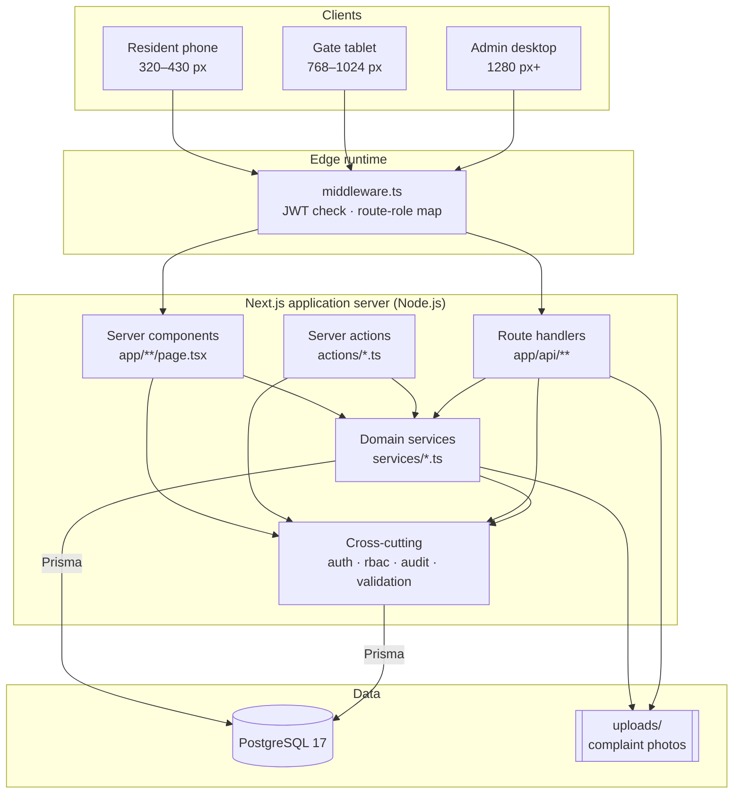
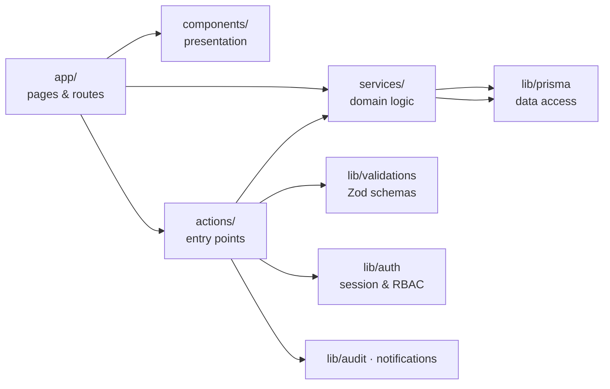
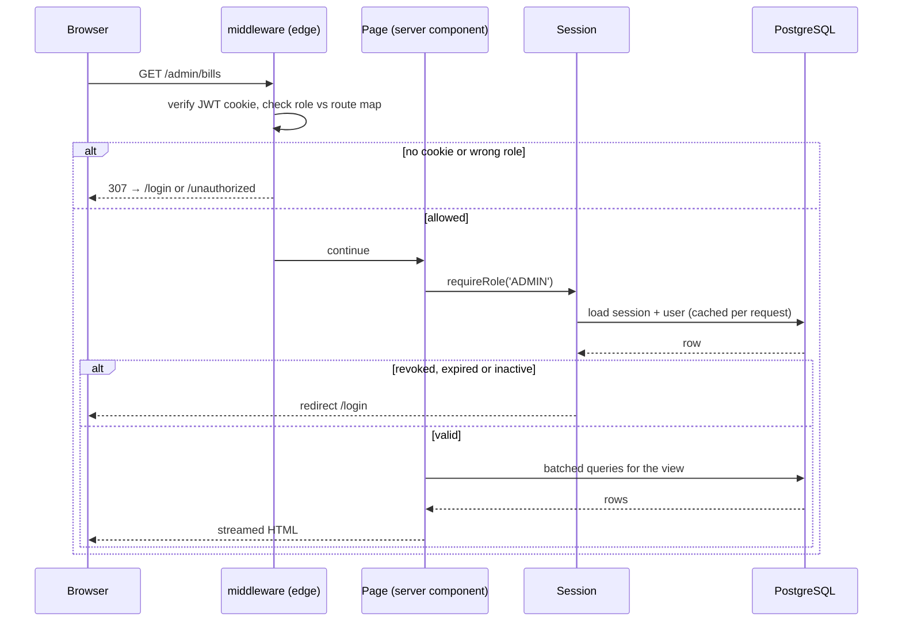
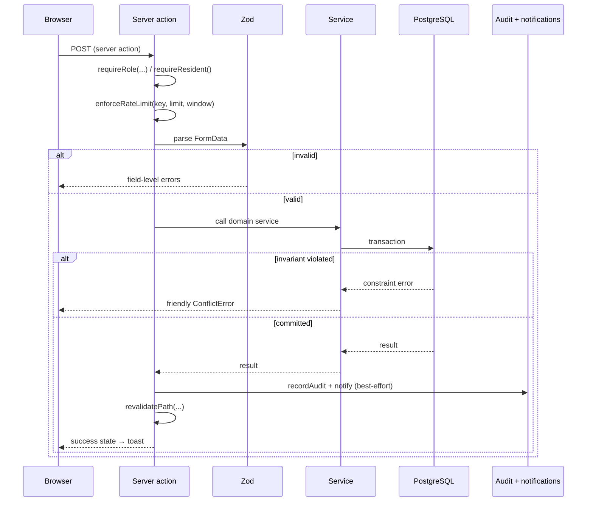
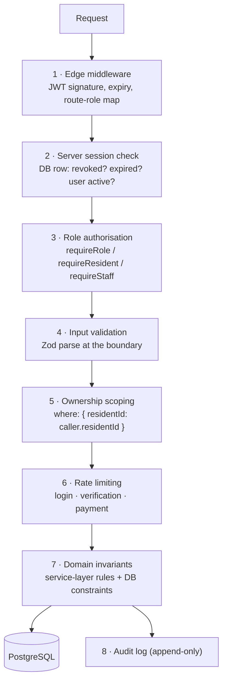

# 3. System Architecture

## 3.1 Overview

SmartSociety is a single deployable Next.js application backed by PostgreSQL.
Rendering, business logic and data access all run in one Node.js process; the
browser receives HTML plus a small amount of interactive JavaScript.



## 3.2 Layering

The codebase is organised so that each concern lives in exactly one place.



| Layer | Directory | Responsibility | Must not |
|---|---|---|---|
| Presentation | `components/` | Rendering, interaction, formatting | Query the database or contain business rules |
| Routing | `app/` | Route definition, authorisation gate, data fetching for the view | Contain reusable business logic |
| Entry points | `actions/` | Authenticate → authorise → validate → call a service → audit → notify → revalidate | Talk to Prisma directly for business writes |
| Domain | `services/` | Business rules, transactions, invariants | Read cookies, headers, or know about HTTP |
| Data | `lib/prisma.ts`, `prisma/schema.prisma` | Schema, connection, migrations | — |
| Cross-cutting | `lib/` | Auth, RBAC, validation, audit, notifications, rate limiting, errors | Depend on `app/` or `components/` |

### Why this shape

Putting **authorisation in the entry-point layer rather than in the UI** is the
important decision. A page can hide a button, but the button is not the security
boundary — the action behind it is. Every server action starts with a
`requireRole()` call and every ownership check re-queries with the caller's own
`residentId` in the `where` clause, so a forged request cannot reach another
resident's record.

Putting **invariants in the domain layer rather than the action layer** is the
second one. "You cannot double-book a slot" and "you cannot pay a cancelled
invoice" are properties of the domain, not of a particular HTTP request, so they
live in `services/` and are covered by integration tests that call the service
directly.

## 3.3 Request lifecycle

### A page request



Two layers guard every route. The edge check is fast and keeps unauthenticated
traffic away from the database; the server-side check is authoritative because
it re-reads the session row, so a logout or a suspension takes effect on the
very next request rather than when the JWT happens to expire.

### A mutation



## 3.4 Directory structure

```
smartsociety/
├── app/                      Routes (Next.js App Router)
│   ├── page.tsx              Landing page with the required sitemap
│   ├── sitemap/              Full-page sitemap
│   ├── login/                Sign-in
│   ├── admin/                Administrator console  (16 routes)
│   ├── resident/             Resident portal        (17 routes)
│   ├── guard/                Gate console           (8 routes)
│   ├── staff/                Maintenance console    (5 routes)
│   ├── account/              Shared account pages   (3 routes)
│   └── api/                  Route handlers (PDF, files, notifications)
│
├── actions/                  Server actions — the write entry points
├── services/                 Domain logic and invariants
├── lib/                      Auth, RBAC, validation, audit, utilities
├── components/
│   ├── ui/                   Design-system primitives
│   ├── shared/               Composite building blocks
│   ├── layout/               App shell, navigation, banners
│   ├── charts/               Recharts wrappers
│   └── marketing/            Landing-page sections
│
├── hooks/                    Client hooks (live notification feed)
├── prisma/                   schema.prisma · migrations · seed.ts
├── database/                 schema.sql (generated SQL deliverable)
├── scripts/                  Local database, setup, SQL export, route check
├── tests/                    unit · integration · e2e
├── docs/                     This documentation
└── uploads/                  Runtime complaint photos (git-ignored)
```

## 3.5 Technology decisions

| Decision | Alternative considered | Rationale |
|---|---|---|
| **Next.js App Router with server components** | A separate Express API plus a React SPA | Halves the moving parts for a single-server deployment. Dashboards render on the server, so a gate tablet downloads markup instead of a large JavaScript bundle plus a waterfall of API calls. |
| **Server actions instead of REST for mutations** | REST endpoints | Removes the hand-written fetch layer and keeps the request and its validation schema in one file. Route handlers are still used where a non-HTML response is needed (PDF, file streaming, polling). |
| **PostgreSQL** | MySQL, SQL Server | Composite unique indexes including an enum column make "one confirmed booking per slot" a database guarantee. `Decimal` avoids floating-point money errors. All three are permitted by the SRS. |
| **Prisma** | Raw SQL, TypeORM | Type-safe queries catch schema drift at compile time, and the migration history doubles as the `.sql` deliverable the SRS asks for. |
| **JWT cookie + session row** | Pure JWT, or pure server sessions | A pure JWT cannot be revoked before it expires; a pure server session needs a database read in edge middleware, which is unavailable. The hybrid gives a fast edge check *and* immediate revocation. |
| **bcrypt (cost 12)** | argon2 | No native compilation, so `npm install` works on any evaluator's machine. Cost 12 keeps a hash around 250 ms — slow for an attacker, invisible inside a 1.5 s page budget. |
| **pdf-lib** | Puppeteer HTML-to-PDF | Pure JavaScript with no headless browser to install or keep alive. A receipt renders in milliseconds inside the request. |
| **Polling for live updates** | WebSockets / SSE | A 45-second poll that pauses on a hidden tab is enough for notifications and the alert banner, and keeps the deployment to one stateless process. |
| **Tailwind CSS 4 with hand-built primitives on Radix** | A component library | Radix supplies the accessibility behaviour; the styling stays a thin, auditable layer with one design-token file driving light, dark and the per-role accent. |

## 3.6 Security architecture



Each layer assumes the ones before it may have been bypassed. Layer 5 is the one
that matters most in practice: rather than fetching a record and then checking
who owns it, every query includes the caller's own identifier in its `where`
clause, so a record belonging to someone else is simply not found.

## 3.7 Performance approach

| Technique | Where | Effect |
|---|---|---|
| Server components | Every dashboard | No client-side data waterfall; HTML streams as soon as the queries resolve |
| Batched queries | `services/dashboard-service.ts` | One `Promise.all` per dashboard rather than one round-trip per tile |
| Request-scoped caching | `lib/auth/session.ts` via `React.cache` | The session is read once per request no matter how many components need it |
| Pagination | Every list | Bounded result sets regardless of society size |
| Targeted indexes | `prisma/schema.prisma` | Every foreign key and every column used in a filter or sort |
| Database aggregation | Reports and dashboards | `groupBy` and `aggregate` run in PostgreSQL, not in Node memory |
| Lazy loading | QR scanner, charts | The ZXing decoder is fetched only when a guard switches to scan mode |
| Selective field loading | Session, list queries | `select` narrows the columns fetched, so a password hash is never even read |
