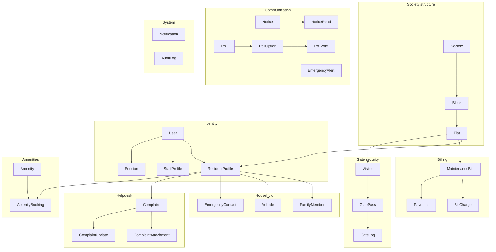

# 4. Database Design

**Engine:** PostgreSQL 17 (SRS permits PostgreSQL 14+)
**ORM:** Prisma 6 · schema at `prisma/schema.prisma`
**Plain SQL:** `database/schema.sql`, generated from the migration history by
`npm run db:sql`

---

## 4.1 Design principles

| Principle | Applied as |
|---|---|
| **Normalised to 3NF** | Charges live in `bill_charges` rather than as columns on the bill; family members, vehicles and contacts are their own tables |
| **Every table has a surrogate key** | `cuid()` primary keys — collision-resistant, sortable-ish, and safe to expose in a URL because they are not guessable sequential integers |
| **Foreign keys are always indexed** | Every relation column carries an index, so joins and filtered lists stay fast at thousands of flats |
| **Soft delete where history matters** | `deletedAt` on users, flats, residents, vehicles, family members, contacts, amenities, notices and polls; hard delete only where a row has no downstream meaning |
| **Money as `Decimal(10,2)`** | Never floating point — `0.1 + 0.2` must equal `0.30` on an invoice |
| **Timestamps everywhere** | `createdAt` / `updatedAt` on every mutable table; the audit log has only `createdAt` because it is never updated |
| **Business rules as constraints** | Where a rule can be a unique index, it is one — the application is then a convenience layer over a guarantee, not the guarantee itself |

---

## 4.2 Entity groups



---

## 4.3 Data dictionary

The SRS specifies five key entities (§1.8.3). Those are marked ★; the remainder
were derived from the functional requirements.

### ★ users

The authentication identity for all four roles.

| Column | Type | Constraints | Description |
|---|---|---|---|
| `id` | text | **PK**, cuid | User identifier |
| `email` | text | **unique**, not null | Sign-in identifier |
| `username` | text | **unique**, not null | Alternative sign-in identifier |
| `passwordHash` | text | not null | bcrypt hash — plaintext is never stored |
| `role` | enum `Role` | not null | ADMIN · RESIDENT · GUARD · MAINTENANCE_STAFF |
| `fullName` | text | not null | Display name |
| `phone` | text | not null | 10-digit mobile number |
| `avatarUrl` | text | nullable | Profile image |
| `status` | enum `UserStatus` | default ACTIVE | ACTIVE · INACTIVE · SUSPENDED |
| `lastLoginAt` | timestamp | nullable | Last successful sign-in |
| `failedLoginCount` | integer | default 0 | Consecutive failures |
| `lockedUntil` | timestamp | nullable | Temporary lockout expiry |
| `createdAt` / `updatedAt` | timestamp | | Audit timestamps |
| `deletedAt` | timestamp | nullable | Soft delete |

*Indexes:* `(role, status)`

### ★ flats

| Column | Type | Constraints | Description |
|---|---|---|---|
| `id` | text | **PK** | Flat identifier |
| `blockId` | text | **FK** → `blocks.id`, cascade | Owning block |
| `flatNumber` | text | not null | e.g. "101" |
| `floor` | integer | default 0 | Floor number |
| `flatType` | enum `FlatType` | default TWO_BHK | STUDIO … PENTHOUSE |
| `carpetAreaSqft` | integer | nullable | Carpet area |
| `occupancyStatus` | enum `OccupancyStatus` | default VACANT | OCCUPIED · VACANT · UNDER_MAINTENANCE |
| `occupancyType` | enum `ResidentType` | nullable | OWNER · TENANT — who lives here |
| `parkingSlots` | integer | default 1 | Allotted parking |
| `baseMaintenance` | decimal(10,2) | default 0 | Per-flat monthly charge |
| `createdAt` / `updatedAt` / `deletedAt` | timestamp | | |

*Constraints:* unique `(blockId, flatNumber)` — a flat number is unique within
its block.
*Indexes:* `occupancyStatus`, `blockId`

### resident_profiles

Links a `User` to a `Flat`. **Flats → Residents is one-to-many** (SRS §1.8.3).

| Column | Type | Constraints | Description |
|---|---|---|---|
| `id` | text | **PK** | Resident identifier |
| `userId` | text | **FK unique** → `users.id`, cascade | One profile per user |
| `flatId` | text | **FK** → `flats.id`, restrict | Cannot delete a flat with residents |
| `residentType` | enum `ResidentType` | default OWNER | OWNER · TENANT |
| `isPrimary` | boolean | default false | Receives billing notifications |
| `moveInDate` | timestamp | default now | |
| `moveOutDate` | timestamp | nullable | Set on offboarding |
| `occupation` | text | nullable | |
| `alternatePhone` | text | nullable | |
| `createdAt` / `updatedAt` / `deletedAt` | timestamp | | |

*Indexes:* `flatId`, `residentType`

### ★ visitors

**Flats → Visitors is one-to-many** (SRS §1.8.3).

| Column | Type | Constraints | Description |
|---|---|---|---|
| `id` | text | **PK** | Visitor identifier |
| `flatId` | text | **FK** → `flats.id`, cascade | Flat being visited |
| `name` | text | not null | |
| `phone` | text | not null | |
| `visitorType` | enum `VisitorType` | default GUEST | GUEST · DELIVERY · CAB · VENDOR · SERVICE · OTHER |
| `vehicleNumber` | text | nullable | Registration number |
| `company` | text | nullable | Courier or vendor company |
| `idProofType` / `idProofNumber` | text | nullable | Collected at the gate |
| `photoUrl` | text | nullable | Visitor photograph |
| `createdAt` / `updatedAt` | timestamp | | |

*Indexes:* `flatId`, `phone`, `visitorType`

> The SRS lists `gate_pass_code` on the Visitors entity. It is normalised onto
> `gate_passes` instead, because one visitor may hold several passes over time
> and a pass carries its own window, status and entry count.

### gate_passes

| Column | Type | Constraints | Description |
|---|---|---|---|
| `id` | text | **PK** | |
| `passCode` | text | **unique** | Human-readable reference, e.g. `GP-7K4M2X` |
| `gateCode` | text | **unique** | 6-digit numeric key for manual entry |
| `qrToken` | text | **unique** | High-entropy opaque token inside the QR image |
| `visitorId` | text | **FK** → `visitors.id` | |
| `flatId` | text | **FK** → `flats.id` | |
| `residentId` | text | **FK** → `resident_profiles.id` | Issuing resident |
| `visitorType` | enum `VisitorType` | | |
| `purpose` | text | nullable | |
| `validFrom` / `validUntil` | timestamp | not null | The visit window |
| `status` | enum `GatePassStatus` | default ACTIVE | ACTIVE · USED · EXPIRED · CANCELLED · REJECTED |
| `maxEntries` / `entriesUsed` | integer | default 1 / 0 | Multi-entry support |
| `cancelledAt` / `cancelReason` | | nullable | |

*Indexes:* `(status, validUntil)`, `flatId`, `residentId`

### gate_logs

**Visitors → GateLogs is one-to-many** (SRS §1.8.3). Append-only by convention.

| Column | Type | Constraints | Description |
|---|---|---|---|
| `id` | text | **PK** | |
| `visitorId` | text | **FK** → `visitors.id` | |
| `flatId` | text | **FK** → `flats.id` | |
| `gatePassId` | text | **FK** nullable, set null | Null for a walk-in |
| `guardId` | text | **FK** → `users.id`, set null | Guard on duty |
| `gate` | text | default 'Main Gate' | |
| `verificationMethod` | enum | default MANUAL | QR_SCAN · GATE_CODE · MANUAL · PRE_APPROVED |
| `status` | enum `GateLogStatus` | default INSIDE | INSIDE · EXITED · DENIED · OVERSTAY |
| `entryAt` / `exitAt` | timestamp | nullable | |
| `expectedExitAt` | timestamp | nullable | Drives overstay detection |
| `overstayNotifiedAt` | timestamp | nullable | Prevents duplicate alerts |
| `denialReason` / `remarks` | text | nullable | |
| `vehicleNumber` | text | nullable | Denormalised for fast search |

*Indexes:* `status`, `entryAt`, `flatId`, `gatePassId`

### ★ maintenance_bills

**Flats → MaintenanceBills is one-to-many** (SRS §1.8.3).

| Column | Type | Constraints | Description |
|---|---|---|---|
| `id` | text | **PK** | |
| `billNumber` | text | **unique** | e.g. `INV-202603-A101` |
| `flatId` | text | **FK** → `flats.id` | |
| `periodMonth` / `periodYear` | integer | not null | Billing period |
| `issueDate` / `dueDate` | timestamp | not null | |
| `baseAmount` | decimal(10,2) | not null | Sum of non-penalty charges |
| `penaltyAmount` | decimal(10,2) | default 0 | |
| `totalAmount` | decimal(10,2) | not null | base + penalty |
| `paidAmount` | decimal(10,2) | default 0 | |
| `status` | enum `BillStatus` | default UNPAID | UNPAID · PARTIALLY_PAID · PAID · OVERDUE · CANCELLED |
| `notes` | text | nullable | |
| `generatedById` | text | **FK** → `users.id`, set null | |

*Constraints:* unique `(flatId, periodYear, periodMonth)` — **a flat can never be
billed twice for the same month**, which makes re-running a billing cycle safe.
*Indexes:* `(status, dueDate)`, `flatId`

### bill_charges

The itemised breakdown the SRS asks residents to see.

| Column | Type | Constraints | Description |
|---|---|---|---|
| `id` | text | **PK** | |
| `billId` | text | **FK** → `maintenance_bills.id`, cascade | |
| `chargeType` | enum `ChargeType` | not null | MAINTENANCE · WATER · SECURITY · REPAIRS · COMMON_ELECTRICITY · SINKING_FUND · PARKING · PENALTY · OTHER |
| `label` | text | not null | Human description |
| `amount` | decimal(10,2) | not null | |

### payments

| Column | Type | Constraints | Description |
|---|---|---|---|
| `id` | text | **PK** | |
| `billId` | text | **FK** → `maintenance_bills.id`, cascade | |
| `residentId` | text | **FK** nullable, set null | Null when the office records it |
| `receiptNumber` | text | **unique** | e.g. `RCPT-20260317-4KX8QW` |
| `transactionRef` | text | **unique** | Gateway reference |
| `amount` | decimal(10,2) | not null | |
| `method` | enum `PaymentMethod` | default UPI | UPI · CARD · NETBANKING · WALLET · CASH · CHEQUE |
| `status` | enum `PaymentStatus` | default SUCCESS | |
| `paidAt` | timestamp | default now | |
| `simulated` | boolean | default true | **Always true in this build** (SRS §1.4) |
| `gatewayResponse` | jsonb | nullable | Simulated gateway payload |

### ★ complaints

**Residents → Complaints is one-to-many** (SRS §1.8.3).

| Column | Type | Constraints | Description |
|---|---|---|---|
| `id` | text | **PK** | |
| `ticketNumber` | text | **unique** | e.g. `TKT-2026-0F3A9C` |
| `residentId` | text | **FK** → `resident_profiles.id` | |
| `flatId` | text | **FK** → `flats.id` | |
| `category` | enum `ComplaintCategory` | not null | Plumbing · Electrical · Elevator · Cleaning · Security · Water · Carpentry · Pest control · Other |
| `priority` | enum `ComplaintPriority` | default MEDIUM | LOW · MEDIUM · HIGH · CRITICAL |
| `status` | enum `ComplaintStatus` | default PENDING | PENDING · IN_PROGRESS · RESOLVED · CLOSED |
| `title` / `description` / `location` | text | | |
| `assignedStaffId` | text | **FK** → `staff_profiles.id`, set null | |
| `assignedAt` | timestamp | nullable | |
| `slaDueAt` | timestamp | not null | Derived from priority |
| `firstResponseAt` / `resolvedAt` / `closedAt` | timestamp | nullable | |
| `resolutionNotes` | text | nullable | |
| `satisfaction` | integer | nullable | 1–5 resident rating |

*Indexes:* `(status, priority)`, `residentId`, `assignedStaffId`, `slaDueAt`

### amenity_bookings

**Residents → AmenityBookings is one-to-many** (SRS §1.8.3).

| Column | Type | Constraints | Description |
|---|---|---|---|
| `id` | text | **PK** | |
| `bookingCode` | text | **unique** | e.g. `BK-9QW3ZT` |
| `amenityId` | text | **FK** → `amenities.id` | |
| `residentId` | text | **FK** → `resident_profiles.id` | |
| `flatId` | text | **FK** → `flats.id` | |
| `startsAt` / `endsAt` | timestamp | not null | |
| `guestsCount` | integer | default 1 | |
| `fee` | decimal(10,2) | default 0 | |
| `status` | enum `BookingStatus` | default CONFIRMED | PENDING · CONFIRMED · CANCELLED · COMPLETED · REJECTED |

*Constraints:* unique `(amenityId, startsAt, status)` — **two `CONFIRMED`
bookings of the same slot are impossible**, while still allowing a cancelled
booking to coexist with the confirmed one that replaced it.
*Indexes:* `(amenityId, startsAt)`, `residentId`, `status`

### poll_votes

| Column | Type | Constraints | Description |
|---|---|---|---|
| `id` | text | **PK** | |
| `pollId` | text | **FK** → `polls.id`, cascade | |
| `optionId` | text | **FK** → `poll_options.id`, cascade | |
| `residentId` | text | **FK** → `resident_profiles.id`, cascade | |

*Constraints:* unique `(pollId, residentId)` — **one vote per resident per
poll**, enforced by the database rather than by application logic alone. An
integration test bypasses the service layer to prove it.

### audit_logs

Append-only. Nothing in the application updates or deletes these rows.

| Column | Type | Constraints | Description |
|---|---|---|---|
| `id` | text | **PK** | |
| `userId` | text | **FK** nullable, set null | Actor |
| `actorName` / `actorRole` | | nullable | Snapshot, so the entry stays readable if the user is removed |
| `action` | text | not null | Dotted key, e.g. `gate.verification` |
| `entityType` / `entityId` | text | | What was acted on |
| `description` | text | not null | Human-readable sentence |
| `metadata` | jsonb | nullable | Structured detail |
| `ipAddress` / `userAgent` | text | nullable | Request provenance |
| `createdAt` | timestamp | default now | No `updatedAt` — it is never updated |

*Indexes:* `userId`, `(entityType, entityId)`, `action`, `createdAt`

### Remaining tables

| Table | Purpose |
|---|---|
| `societies` | Society identity, address, billing policy, guidelines |
| `blocks` | Towers or wings within a society |
| `sessions` | Server-side session records enabling immediate revocation |
| `staff_profiles` | Guards and technicians: department, designation, shift, gate posting, skills |
| `family_members` | Household members per resident |
| `vehicles` | Registered vehicles (registration number unique society-wide) |
| `emergency_contacts` | Society directory and per-resident personal contacts |
| `complaint_attachments` | Uploaded complaint photos (storage key, MIME, size) |
| `complaint_updates` | Status history and work notes, with an internal flag |
| `amenities` | Bookable facilities and their booking policy |
| `notices` | Announcements with category, priority, audience and publish window |
| `notice_reads` | Read receipts per user per notice |
| `polls` / `poll_options` | Community polls |
| `emergency_alerts` | Broadcast alerts with severity, instructions and resolution |
| `notifications` | In-app notification inbox |

---

## 4.4 Enumerations

| Enum | Values |
|---|---|
| `Role` | ADMIN · RESIDENT · GUARD · MAINTENANCE_STAFF |
| `UserStatus` | ACTIVE · INACTIVE · SUSPENDED |
| `ResidentType` | OWNER · TENANT |
| `OccupancyStatus` | OCCUPIED · VACANT · UNDER_MAINTENANCE |
| `FlatType` | ONE_BHK · TWO_BHK · THREE_BHK · FOUR_BHK · PENTHOUSE · STUDIO |
| `VehicleType` | CAR · BIKE · SCOOTER · BICYCLE · OTHER |
| `StaffDepartment` | PLUMBING · ELECTRICAL · HOUSEKEEPING · ELEVATOR · GARDENING · SECURITY · GENERAL |
| `VisitorType` | GUEST · DELIVERY · CAB · VENDOR · SERVICE · OTHER |
| `GatePassStatus` | ACTIVE · USED · EXPIRED · CANCELLED · REJECTED |
| `VerificationMethod` | QR_SCAN · GATE_CODE · MANUAL · PRE_APPROVED |
| `GateLogStatus` | INSIDE · EXITED · DENIED · OVERSTAY |
| `BillStatus` | UNPAID · PARTIALLY_PAID · PAID · OVERDUE · CANCELLED |
| `ChargeType` | MAINTENANCE · WATER · SECURITY · REPAIRS · COMMON_ELECTRICITY · SINKING_FUND · PARKING · PENALTY · OTHER |
| `PaymentMethod` | UPI · CARD · NETBANKING · WALLET · CASH · CHEQUE |
| `PaymentStatus` | PENDING · SUCCESS · FAILED · REFUNDED |
| `ComplaintCategory` | PLUMBING · ELECTRICAL · ELEVATOR · CLEANING · SECURITY · WATER · CARPENTRY · PEST_CONTROL · OTHER |
| `ComplaintPriority` | LOW · MEDIUM · HIGH · CRITICAL |
| `ComplaintStatus` | PENDING · IN_PROGRESS · RESOLVED · CLOSED |
| `BookingStatus` | PENDING · CONFIRMED · CANCELLED · COMPLETED · REJECTED |
| `NoticeCategory` | GENERAL · MAINTENANCE · EVENT · FINANCIAL · SECURITY · GUIDELINE · EMERGENCY |
| `NoticePriority` | LOW · NORMAL · HIGH · URGENT |
| `NoticeAudience` | ALL · RESIDENTS · OWNERS · TENANTS · STAFF |
| `PollStatus` | DRAFT · ACTIVE · CLOSED |
| `AlertType` | FIRE · SECURITY · MEDICAL · WATER_SHUTDOWN · POWER_OUTAGE · GAS_LEAK · NATURAL_DISASTER · GENERAL |
| `AlertSeverity` | INFO · WARNING · CRITICAL |
| `AlertStatus` | ACTIVE · RESOLVED |
| `NotificationType` | 19 values covering gate, billing, helpdesk, booking, notice, poll and emergency events |
| `EmergencyContactScope` | SOCIETY_DIRECTORY · RESIDENT_PERSONAL |

---

## 4.5 Referential integrity

| Relationship | On delete | Why |
|---|---|---|
| `Block → Flat` | Cascade | A block cannot exist without its flats |
| `Flat → ResidentProfile` | **Restrict** | A flat with residents must not be deletable; offboard them first |
| `User → ResidentProfile` | Cascade | The profile is meaningless without its login |
| `Flat → MaintenanceBill` | Cascade | Bills belong to the flat |
| `MaintenanceBill → BillCharge` / `Payment` | Cascade | Lines and payments belong to the bill |
| `Visitor → GatePass` / `GateLog` | Cascade | |
| `GatePass → GateLog` | **Set null** | A gate log survives even if its pass is removed, preserving the security record |
| `User → GateLog.guard` | **Set null** | The movement record outlives the employment record |
| `User → AuditLog` | **Set null** | The audit entry keeps a name snapshot and survives user deletion |

---

## 4.6 Migrations and the SQL deliverable

```bash
npm run db:migrate      # create a migration during development
npm run db:deploy       # apply migrations (production / CI)
npm run db:sql          # regenerate database/schema.sql from the migrations
```

`database/schema.sql` contains the full `CREATE TYPE` / `CREATE TABLE` /
`CREATE INDEX` / `ALTER TABLE … ADD CONSTRAINT` script and can be applied
directly:

```bash
createdb smartsociety
psql -d smartsociety -f database/schema.sql
```
