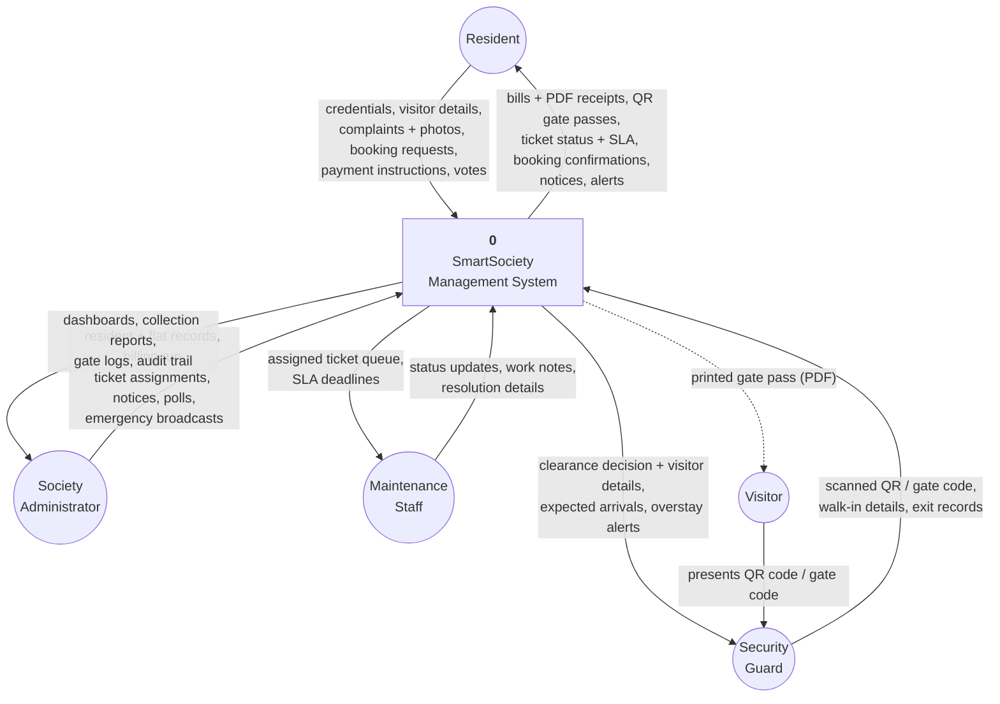
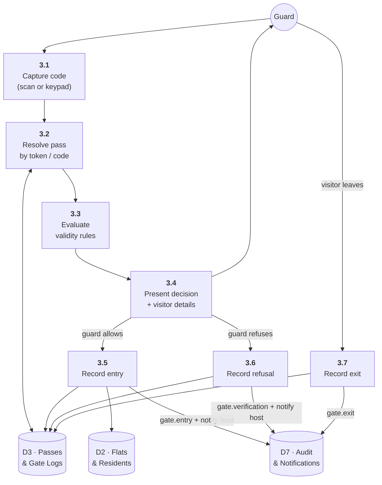

# 6. Data Flow Diagrams

## 6.1 Level 0 — Context diagram

The whole system as a single process, showing every external entity and the data
that crosses the boundary.

## 6.2 Level 1 — Process decomposition

The system broken into its seven processes and seven data stores.

```mermaid
flowchart TB
    R(("Resident"))
    G(("Guard"))
    A(("Admin"))
    M(("Staff"))

    P1["<b>1.0</b><br/>Authentication &<br/>Access Control"]
    P2["<b>2.0</b><br/>Resident & Flat<br/>Management"]
    P3["<b>3.0</b><br/>Visitor & Gate<br/>Management"]
    P4["<b>4.0</b><br/>Maintenance<br/>Billing"]
    P5["<b>5.0</b><br/>Complaint<br/>Management"]
    P6["<b>6.0</b><br/>Amenity<br/>Booking"]
    P7["<b>7.0</b><br/>Communication<br/>& Alerts"]

    D1[("D1 · Users & Sessions")]
    D2[("D2 · Flats & Residents")]
    D3[("D3 · Visitors, Passes<br/>& Gate Logs")]
    D4[("D4 · Bills & Payments")]
    D5[("D5 · Complaints")]
    D6[("D6 · Amenities & Bookings")]
    D7[("D7 · Notices, Polls,<br/>Alerts & Audit")]

    R --> P1
    G --> P1
    A --> P1
    M --> P1
    P1 <--> D1
    P1 -- "authorised session" --> P2 & P3 & P4 & P5 & P6 & P7

    A --> P2
    P2 <--> D2
    P2 -- "new login" --> D1
    P2 -- "onboarding event" --> D7

    R -- "pass request" --> P3
    G -- "scan / walk-in / exit" --> P3
    P3 <--> D3
    P3 -- "flat lookup" --> D2
    P3 -- "gate audit + notification" --> D7

    A -- "billing run, penalties" --> P4
    R -- "payment instruction" --> P4
    P4 <--> D4
    P4 -- "occupied flats + base charge" --> D2
    P4 -- "financial audit + notification" --> D7

    R -- "new ticket + photos" --> P5
    A -- "assignment" --> P5
    M -- "status update + notes" --> P5
    P5 <--> D5
    P5 -- "resident + flat" --> D2
    P5 -- "status-change audit + notification" --> D7

    R -- "booking request" --> P6
    A -- "amenity config, approval" --> P6
    P6 <--> D6
    P6 -- "booking audit + notification" --> D7

    A -- "notice, poll, alert" --> P7
    R -- "vote, read receipt" --> P7
    P7 <--> D7

    P3 -- "clearance decision" --> G
    P4 -- "bill + receipt" --> R
    P5 -- "queue" --> M
    P7 -- "alert banner" --> R & G & M
```

### Process descriptions

| # | Process | Inputs | Outputs | Data stores |
|---|---|---|---|---|
| 1.0 | **Authentication & access control** | Credentials, session cookie | Authorised session, role, redirect | D1 (read/write), D7 (audit) |
| 2.0 | **Resident & flat management** | Flat and resident records, onboarding and offboarding requests | Occupancy map, resident directory, temporary password | D2 (read/write), D1 (write), D7 (audit) |
| 3.0 | **Visitor & gate management** | Pass requests, scanned codes, walk-in details, exit records | QR passes, clearance decisions, gate logs, overstay alerts | D3 (read/write), D2 (read), D7 (audit + notify) |
| 4.0 | **Maintenance billing** | Billing-run parameters, payment instructions | Invoices, PDF receipts, collection reports | D4 (read/write), D2 (read), D7 (audit + notify) |
| 5.0 | **Complaint management** | Tickets, photos, assignments, status updates | Ticket queue, SLA state, resolution history | D5 (read/write), D2 (read), D7 (audit + notify) |
| 6.0 | **Amenity booking** | Availability queries, booking requests, approvals | Slot grid, confirmations, cancellations | D6 (read/write), D7 (audit + notify) |
| 7.0 | **Communication & alerts** | Notices, polls, votes, emergency broadcasts | Notice board, poll results, alert banner, notification inbox | D7 (read/write), D2 (read) |

### Data store contents

| Store | Tables |
|---|---|
| D1 · Users & Sessions | `users`, `sessions` |
| D2 · Flats & Residents | `societies`, `blocks`, `flats`, `resident_profiles`, `staff_profiles`, `family_members`, `vehicles`, `emergency_contacts` |
| D3 · Visitors, Passes & Gate Logs | `visitors`, `gate_passes`, `gate_logs` |
| D4 · Bills & Payments | `maintenance_bills`, `bill_charges`, `payments` |
| D5 · Complaints | `complaints`, `complaint_attachments`, `complaint_updates` |
| D6 · Amenities & Bookings | `amenities`, `amenity_bookings` |
| D7 · Notices, Polls, Alerts & Audit | `notices`, `notice_reads`, `polls`, `poll_options`, `poll_votes`, `emergency_alerts`, `notifications`, `audit_logs` |

## 6.3 Level 2 — Gate verification (process 3.0 expanded)

The most detailed flow, because it is the one with the tightest latency budget
(< 2 s) and the most rejection paths.

**3.3 — validity rules, evaluated in order.** The first failure short-circuits,
so a guard always sees exactly one reason:

1. Is the pass cancelled? → *The resident cancelled this pass.*
2. Was entry previously refused? → *Entry on this pass was previously refused.*
3. Is the window still in the future? → *Not valid yet, becomes active at …*
4. Has the window closed? → *Expired at …* (and the pass is marked `EXPIRED`)
5. Are all permitted entries used? → *Already used / all N entries used.*
6. Is this visitor already recorded inside? → *Record an exit before scanning again.*
7. Otherwise → **allow**, and show the visitor, host flat and host contact.

Step 3.5 is a separate confirmation, so scanning never consumes an entry by
accident.
