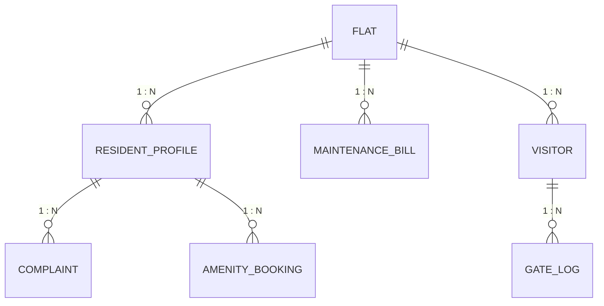

# 5. Entity–Relationship Diagram

## 5.1 Complete ER diagram

```mermaid
erDiagram
    SOCIETY ||--o{ BLOCK : "contains"
    SOCIETY ||--o{ AMENITY : "offers"
    BLOCK   ||--o{ FLAT : "contains"

    USER ||--o| RESIDENT_PROFILE : "may be"
    USER ||--o| STAFF_PROFILE : "may be"
    USER ||--o{ SESSION : "holds"
    USER ||--o{ NOTIFICATION : "receives"
    USER ||--o{ AUDIT_LOG : "performs"

    FLAT ||--o{ RESIDENT_PROFILE : "houses"
    FLAT ||--o{ MAINTENANCE_BILL : "is billed"
    FLAT ||--o{ VISITOR : "receives"
    FLAT ||--o{ GATE_PASS : "targets"
    FLAT ||--o{ GATE_LOG : "records"
    FLAT ||--o{ COMPLAINT : "raises"
    FLAT ||--o{ VEHICLE : "parks"
    FLAT ||--o{ AMENITY_BOOKING : "books"

    RESIDENT_PROFILE ||--o{ FAMILY_MEMBER : "declares"
    RESIDENT_PROFILE ||--o{ VEHICLE : "owns"
    RESIDENT_PROFILE ||--o{ EMERGENCY_CONTACT : "lists"
    RESIDENT_PROFILE ||--o{ COMPLAINT : "files"
    RESIDENT_PROFILE ||--o{ AMENITY_BOOKING : "reserves"
    RESIDENT_PROFILE ||--o{ GATE_PASS : "issues"
    RESIDENT_PROFILE ||--o{ PAYMENT : "makes"
    RESIDENT_PROFILE ||--o{ POLL_VOTE : "casts"

    STAFF_PROFILE ||--o{ COMPLAINT : "is assigned"

    VISITOR   ||--o{ GATE_PASS : "is issued"
    VISITOR   ||--o{ GATE_LOG : "generates"
    GATE_PASS ||--o{ GATE_LOG : "authorises"

    MAINTENANCE_BILL ||--o{ BILL_CHARGE : "itemises"
    MAINTENANCE_BILL ||--o{ PAYMENT : "is settled by"

    COMPLAINT ||--o{ COMPLAINT_ATTACHMENT : "has"
    COMPLAINT ||--o{ COMPLAINT_UPDATE : "tracks"

    AMENITY ||--o{ AMENITY_BOOKING : "is reserved as"

    NOTICE ||--o{ NOTICE_READ : "is read as"
    POLL   ||--o{ POLL_OPTION : "offers"
    POLL   ||--o{ POLL_VOTE : "collects"
    POLL_OPTION ||--o{ POLL_VOTE : "receives"

    SOCIETY {
        string id PK
        string name
        string registrationNo UK
        string city
        decimal penaltyPercent
        int penaltyGraceDays
        string guidelines
    }

    BLOCK {
        string id PK
        string societyId FK
        string name
        int totalFloors
    }

    FLAT {
        string id PK
        string blockId FK
        string flatNumber
        int floor
        enum flatType
        enum occupancyStatus
        enum occupancyType
        decimal baseMaintenance
    }

    USER {
        string id PK
        string email UK
        string username UK
        string passwordHash
        enum role
        string fullName
        string phone
        enum status
    }

    RESIDENT_PROFILE {
        string id PK
        string userId FK,UK
        string flatId FK
        enum residentType
        boolean isPrimary
        datetime moveInDate
        datetime moveOutDate
    }

    STAFF_PROFILE {
        string id PK
        string userId FK,UK
        string employeeCode UK
        enum department
        string designation
        string gateAssignment
    }

    FAMILY_MEMBER {
        string id PK
        string residentId FK
        string fullName
        string relation
        int age
    }

    VEHICLE {
        string id PK
        string residentId FK
        string flatId FK
        string registrationNo UK
        enum vehicleType
        string parkingSlot
    }

    EMERGENCY_CONTACT {
        string id PK
        string residentId FK
        enum scope
        string name
        string phone
        int sortOrder
    }

    VISITOR {
        string id PK
        string flatId FK
        string name
        string phone
        enum visitorType
        string vehicleNumber
        string company
        string photoUrl
    }

    GATE_PASS {
        string id PK
        string passCode UK
        string gateCode UK
        string qrToken UK
        string visitorId FK
        string flatId FK
        string residentId FK
        datetime validFrom
        datetime validUntil
        enum status
        int maxEntries
        int entriesUsed
    }

    GATE_LOG {
        string id PK
        string visitorId FK
        string flatId FK
        string gatePassId FK
        string guardId FK
        string gate
        enum verificationMethod
        enum status
        datetime entryAt
        datetime exitAt
        datetime expectedExitAt
    }

    MAINTENANCE_BILL {
        string id PK
        string billNumber UK
        string flatId FK
        int periodMonth
        int periodYear
        datetime dueDate
        decimal baseAmount
        decimal penaltyAmount
        decimal totalAmount
        decimal paidAmount
        enum status
    }

    BILL_CHARGE {
        string id PK
        string billId FK
        enum chargeType
        string label
        decimal amount
    }

    PAYMENT {
        string id PK
        string billId FK
        string residentId FK
        string receiptNumber UK
        string transactionRef UK
        decimal amount
        enum method
        enum status
        boolean simulated
    }

    COMPLAINT {
        string id PK
        string ticketNumber UK
        string residentId FK
        string flatId FK
        string assignedStaffId FK
        enum category
        enum priority
        enum status
        datetime slaDueAt
        datetime resolvedAt
        int satisfaction
    }

    COMPLAINT_ATTACHMENT {
        string id PK
        string complaintId FK
        string storageKey
        string mimeType
        int sizeBytes
    }

    COMPLAINT_UPDATE {
        string id PK
        string complaintId FK
        string authorId FK
        enum fromStatus
        enum toStatus
        string note
        boolean isInternal
    }

    AMENITY {
        string id PK
        string societyId FK
        string name
        string slug UK
        int capacity
        int openMinute
        int closeMinute
        int slotMinutes
        decimal bookingFee
        boolean requiresApproval
    }

    AMENITY_BOOKING {
        string id PK
        string bookingCode UK
        string amenityId FK
        string residentId FK
        string flatId FK
        datetime startsAt
        datetime endsAt
        enum status
        decimal fee
    }

    NOTICE {
        string id PK
        string title
        enum category
        enum priority
        enum audience
        datetime publishAt
        datetime expiresAt
        boolean isPinned
    }

    NOTICE_READ {
        string id PK
        string noticeId FK
        string userId FK
        datetime readAt
    }

    POLL {
        string id PK
        string title
        enum status
        datetime startsAt
        datetime endsAt
        boolean isAnonymous
    }

    POLL_OPTION {
        string id PK
        string pollId FK
        string label
        int sortOrder
    }

    POLL_VOTE {
        string id PK
        string pollId FK
        string optionId FK
        string residentId FK
    }

    EMERGENCY_ALERT {
        string id PK
        enum type
        enum severity
        string title
        enum status
        boolean sirenEnabled
        datetime startedAt
        datetime resolvedAt
    }

    NOTIFICATION {
        string id PK
        string userId FK
        enum type
        string title
        string link
        boolean isUrgent
        datetime readAt
    }

    AUDIT_LOG {
        string id PK
        string userId FK
        string actorName
        enum actorRole
        string action
        string entityType
        string entityId
        json metadata
        datetime createdAt
    }

    SESSION {
        string id PK
        string userId FK
        string tokenHash UK
        datetime expiresAt
        datetime revokedAt
    }
```

## 5.2 The relationships the SRS specifies

SRS §1.8.3 mandates five key relationships. All five are implemented exactly as
stated.

| SRS relationship | Implementation | Verified by |
|---|---|---|
| Flats → Residents (1:N) | `ResidentProfile.flatId` → `Flat.id` | An owner and a tenant share a flat in the seed data |
| Flats → MaintenanceBills (1:N) | `MaintenanceBill.flatId` → `Flat.id`, unique per period | `tests/integration/billing.test.ts` |
| Residents → Complaints (1:N) | `Complaint.residentId` → `ResidentProfile.id` | `tests/integration/complaints.test.ts` |
| Flats → Visitors → GateLogs (1:N:N) | `Visitor.flatId` → `Flat.id`; `GateLog.visitorId` → `Visitor.id` | `tests/integration/gate.test.ts` |
| Residents → AmenityBookings (1:N) | `AmenityBooking.residentId` → `ResidentProfile.id` | `tests/integration/amenities-and-polls.test.ts` |

## 5.3 Cardinality notes

| Relationship | Cardinality | Note |
|---|---|---|
| User ↔ ResidentProfile | 1 : 0..1 | Only users with role `RESIDENT` have one |
| User ↔ StaffProfile | 1 : 0..1 | Guards and technicians |
| Flat ↔ ResidentProfile | 1 : 0..N | A vacant flat has none; a let flat may list both the owner and the tenant. Exactly one is `isPrimary` |
| Visitor ↔ GatePass | 1 : 0..N | A visitor may hold several passes over time |
| GatePass ↔ GateLog | 1 : 0..N | A multi-entry pass produces one log per entry |
| GateLog ↔ GatePass | 0..1 : 1 | A walk-in log has no pass |
| Poll ↔ PollVote per resident | 1 : 0..1 | Enforced by `unique(pollId, residentId)` |
| Amenity ↔ confirmed booking per slot | 1 : 0..1 | Enforced by `unique(amenityId, startsAt, status)` |
