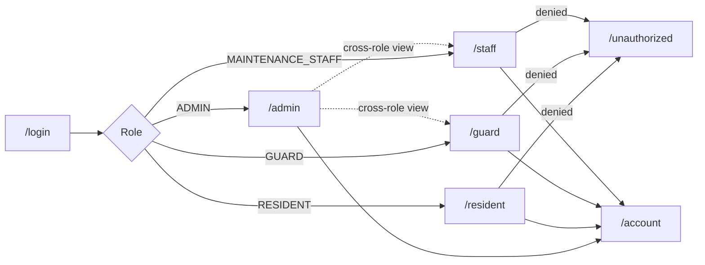

# 9. Sitemap

The SRS requires a sitemap that helps users understand the flow of the
application, and requires it to be **on the home page**. It is rendered there as
an interactive visual tree (see the *Sitemap* section of `/`), on a dedicated
page at `/sitemap`, and reproduced here.

The single source of truth is `lib/sitemap.ts`, so the landing page, the
standalone page and this document can never drift apart.

## 9.1 Visual sitemap

```mermaid
flowchart TB
    ROOT["SmartSociety"]

    ROOT --> PUB["Public area"]
    ROOT --> LOGIN["/login<br/>Sign in"]

    PUB --> P1["/ Home"]
    PUB --> P2["/sitemap"]

    LOGIN --> ADM["Administrator<br/>/admin"]
    LOGIN --> RES["Resident<br/>/resident"]
    LOGIN --> GRD["Security guard<br/>/guard"]
    LOGIN --> STF["Maintenance staff<br/>/staff"]
    LOGIN --> ACC["My account<br/>/account"]

    ADM --> A1["Overview<br/>Dashboard · Reports"]
    ADM --> A2["Community<br/>Flats · Residents · Staff"]
    ADM --> A3["Security<br/>Visitors · Gate logs · Alerts"]
    ADM --> A4["Operations<br/>Bills · Payments · Complaints · Amenities"]
    ADM --> A5["Communication<br/>Notices · Polls"]
    ADM --> A6["System<br/>Audit log · Settings"]

    RES --> R1["My home<br/>Dashboard · My flat · Vehicles"]
    RES --> R2["Money<br/>Bills · Payment history"]
    RES --> R3["Services<br/>Visitor passes · Complaints · Amenities"]
    RES --> R4["Community<br/>Notices · Polls · Guidelines · Emergency"]

    GRD --> G1["Gate<br/>Dashboard · Verify pass · Walk-in entry"]
    GRD --> G2["Records<br/>Visitor log · Expected today · Vehicles"]
    GRD --> G3["Awareness<br/>Alerts · Directory"]

    STF --> S1["Work<br/>Dashboard · Assigned tickets · Completed work"]
    STF --> S2["Society<br/>Notices · Alerts"]

    ACC --> C1["Profile · Notifications · Security"]
```

## 9.2 Complete route table

### Public — no sign-in required

| Route | Page | Purpose |
|---|---|---|
| `/` | Home | Product overview, features, role breakdown, security, **and the sitemap** |
| `/sitemap` | Sitemap | Full-page map of every screen |
| `/login` | Sign in | Role-based authentication with demo account shortcuts |
| `/unauthorized` | Access denied | Shown when a signed-in user reaches another role's area |
| *any unmatched* | 404 | Friendly not-found page |

### Administrator — `ADMIN`

| Route | Page | Purpose |
|---|---|---|
| `/admin` | Dashboard | Occupancy, collection, security and helpdesk overview with charts |
| `/admin/reports` | Reports | Collection by block, technician performance, amenity usage, gate analytics |
| `/admin/flats` | Flats & units | Unit register plus a visual occupancy map; create, edit and archive |
| `/admin/residents` | Residents | Onboard, edit and offboard owners and tenants |
| `/admin/staff` | Staff directory | Guards and technicians, departments and workload |
| `/admin/visitors` | Visitors | Every gate pass issued, with status and usage |
| `/admin/security` | Gate logs | Entry/exit records, overstays, refusals, seven-day traffic chart |
| `/admin/bills` | Maintenance bills | Billing run, penalty application, collection tracking |
| `/admin/payments` | Payments | Payment ledger with receipt downloads |
| `/admin/complaints` | Complaints | Helpdesk queue with SLA and assignment status |
| `/admin/complaints/[id]` | Ticket | Assign, change status, review history |
| `/admin/amenities` | Amenities | Configure facilities, approve requests, view the schedule |
| `/admin/notices` | Notices | Publish, schedule and retire announcements |
| `/admin/polls` | Polls | Create polls, open and close voting, view tallies |
| `/admin/alerts` | Emergency alerts | Broadcast and resolve society-wide alerts |
| `/admin/audit` | Audit log | Immutable, filterable record of every significant action |
| `/admin/settings` | Settings | Society identity, billing policy, guidelines, emergency directory |

### Resident — `RESIDENT`

| Route | Page | Purpose |
|---|---|---|
| `/resident` | Dashboard | Dues, tickets, passes, bookings, notices and polls |
| `/resident/flat` | My flat | Unit details, household members, co-residents, vehicles |
| `/resident/vehicles` | Vehicles | Register and manage vehicles |
| `/resident/bills` | Maintenance bills | Current and historical invoices |
| `/resident/bills/[id]` | Bill detail | Charge breakdown, payment, receipt download |
| `/resident/payments` | Payment history | Past payments with PDF receipts |
| `/resident/visitors` | Visitor passes | Active and past passes, plus gate activity for the flat |
| `/resident/visitors/new` | New pass | Create a QR gate pass with a time window |
| `/resident/visitors/[id]` | Pass detail | QR image, gate code, SMS share, PDF, gate history |
| `/resident/complaints` | My complaints | Ticket list with SLA state |
| `/resident/complaints/new` | Raise a ticket | Category, priority, description, photos |
| `/resident/complaints/[id]` | Ticket detail | Progress timeline, follow-up note, rating |
| `/resident/amenities` | Amenity booking | Live slot grid, booking, cancellation, history |
| `/resident/notices` | Notice board | Announcements and the event calendar |
| `/resident/notices/[id]` | Notice detail | Full announcement with event details |
| `/resident/polls` | Polls & voting | Cast one vote per poll; view results |
| `/resident/guidelines` | Guidelines | The society rulebook |
| `/resident/emergency` | Emergency contacts | Society directory plus personal contacts |

### Security guard — `GUARD` (administrators may also view)

| Route | Page | Purpose |
|---|---|---|
| `/guard` | Gate dashboard | Today's traffic, overstays, expected visitors, recent movements |
| `/guard/verify` | Verify pass | QR scanner and numeric keypad, then allow or refuse |
| `/guard/walk-in` | Walk-in entry | Log a visitor with no pre-approval |
| `/guard/logs` | Visitor log | Filterable movement history with exit recording |
| `/guard/expected` | Expected today | Pre-approved passes valid now or later today |
| `/guard/vehicles` | Vehicle register | Look up which flat a registration belongs to |
| `/guard/alerts` | Alerts | Active and past emergency broadcasts |
| `/guard/directory` | Directory | One-tap emergency numbers |

### Maintenance staff — `MAINTENANCE_STAFF` (administrators may also view)

| Route | Page | Purpose |
|---|---|---|
| `/staff` | My dashboard | Queue ordered by service-level deadline |
| `/staff/tickets` | Assigned tickets | Filterable list of assigned work |
| `/staff/tickets/[id]` | Ticket detail | Status change, work notes, resolution, resident contact |
| `/staff/history` | Completed work | Resolved tickets, SLA outcome and resident ratings |
| `/staff/notices` | Notices | Announcements relevant to staff |
| `/staff/alerts` | Alerts | Emergency broadcasts |

### Shared account pages — any signed-in user

| Route | Page | Purpose |
|---|---|---|
| `/account` | My profile | Name, email, phone, occupation |
| `/account/notifications` | Notifications | Full inbox with read/unread filtering |
| `/account/security` | Security | Change password, review active sessions and sign-in history |

### API routes

| Route | Method | Access | Purpose |
|---|---|---|---|
| `/api/notifications` | GET | Any signed-in user | Unread count, latest notifications, active alert (polled) |
| `/api/bills/[id]/receipt` | GET | Owning resident or admin | Receipt or invoice PDF |
| `/api/passes/[id]/pdf` | GET | Host resident, guard or admin | Printable A5 gate pass |
| `/api/files/[...key]` | GET | Ticket owner, assigned technician or admin | Complaint photo |

## 9.3 Navigation flow by role

An administrator may open the guard and staff consoles to observe operations,
but never a resident's private area — their bills, tickets and passes stay
scoped to them.
