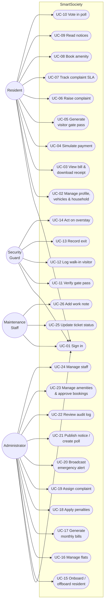

# 7. Use Cases

## 7.1 Use-case diagram

## 7.2 Detailed use-case specifications

---

### UC-05 · Generate a visitor gate pass

| | |
|---|---|
| **Actor** | Resident |
| **Goal** | Pre-approve a visitor so they can be cleared at the gate without a phone call |
| **Precondition** | Signed in as a resident with a linked flat |
| **Postcondition** | An `ACTIVE` gate pass exists with a QR token and a unique 6-digit gate code; guards are notified; an audit entry is written |

**Main flow**

1. The resident opens **Visitor passes → New pass**.
2. They pick a visitor type (Guest, Delivery, Cab, Vendor, Service, Other).
3. They enter the visitor's name and mobile number, and optionally the vehicle
   number, company and purpose.
4. They set the visit window; it defaults to *now* until four hours later.
5. They choose the number of permitted entries (1 by default).
6. They submit.
7. The system validates the input, creates the `Visitor` and the `GatePass` in
   one transaction, generates the pass code, gate code and QR token, notifies
   the resident and every guard, and writes `gatepass.created` to the audit log.
8. The resident is taken to the pass page showing the QR image, the gate code, a
   copy button, an SMS link and a downloadable A5 PDF.

**Alternative flows**

- **A1 — Invalid window.** The end is before the start, the window has already
  elapsed, or it exceeds 30 days → the field is flagged with a specific message
  and nothing is created.
- **A2 — Invalid phone or vehicle number.** Field-level validation message.
- **A3 — Rate limit.** More than 20 passes in an hour from one resident → the
  request is refused with a retry-after message.

---

### UC-11 · Verify a gate pass

| | |
|---|---|
| **Actor** | Security guard |
| **Goal** | Decide in seconds whether a visitor may enter |
| **Precondition** | Signed in as a guard; the visitor presents a QR code or a 6-digit code |
| **Postcondition** | Either a `GateLog` with status `INSIDE` and a decremented pass allowance, or a `DENIED` log with a reason. Either way an audit entry is written |

**Main flow**

1. The guard opens **Verify pass**.
2. They either scan the QR with the camera or type the 6-digit code on the
   on-screen keypad.
3. They press **Verify pass**.
4. The system resolves the code (QR payload, pass code or gate code) and
   evaluates the validity rules in order.
5. On success the console shows *Pass is valid* with the visitor, the host flat,
   the host's name and phone, the vehicle and the remaining entries.
6. The guard presses **Allow entry**.
7. The system records the entry, consumes one allowance, notifies the host flat
   that their visitor has arrived, and writes `gate.entry` to the audit log.

**Alternative flows**

- **A1 — Not found.** *No gate pass matches this code.* The guard is prompted to
  log a walk-in instead.
- **A2 — Not yet valid.** *This pass becomes active at …*
- **A3 — Expired.** *This pass expired at …* and the pass is marked `EXPIRED`.
- **A4 — Cancelled or previously refused.** The reason is shown.
- **A5 — All entries used.**
- **A6 — Already inside.** *Record an exit before scanning again* — this is the
  duplicate-scan guard.
- **A7 — Guard refuses entry.** They press **Refuse**, enter a reason, and the
  system records a `DENIED` log, marks the pass `REJECTED` and notifies the host
  flat.

**Non-functional constraint:** the decision must be returned in under two
seconds (SRS §1.5). It is a single indexed lookup with no external calls.

---

### UC-17 · Generate monthly maintenance bills

| | |
|---|---|
| **Actor** | Administrator |
| **Goal** | Raise one itemised invoice per occupied flat for a billing period |
| **Precondition** | Signed in as an administrator; at least one occupied flat with a resident |
| **Postcondition** | One `MaintenanceBill` per eligible flat with its `BillCharge` lines; every billed flat is notified; an audit entry records the run |

**Main flow**

1. The administrator opens **Maintenance bills → Generate bills**.
2. They choose the month, year and due date.
3. They review the common charge lines (water, security, common electricity,
   repairs, sinking fund), editing amounts or adding lines as needed.
4. They optionally restrict the run to one block.
5. They submit.
6. For every occupied flat with a resident, the system creates an invoice whose
   base amount is the flat's own `baseMaintenance` plus the common charges, with
   one `BillCharge` row per component.
7. Each billed flat receives a *Maintenance bill is ready* notification.
8. `bill.generated` is written to the audit log with the count and total.

**Alternative flows**

- **A1 — Already billed.** Flats that already have an invoice for that period
  are skipped and reported, so re-running the cycle is safe. The unique index on
  `(flatId, periodYear, periodMonth)` guarantees this.
- **A2 — No occupied flats.** The run is refused with an explanatory message.

---

### UC-04 · Simulate a payment

| | |
|---|---|
| **Actor** | Resident (or Administrator recording an offline payment) |
| **Goal** | Settle an invoice in full or in part and obtain a receipt |
| **Precondition** | An invoice with an outstanding balance exists for the caller's own flat |
| **Postcondition** | A `SUCCESS` payment with a unique receipt number and transaction reference; the bill's paid amount and status are updated atomically |

**Main flow**

1. The resident opens the invoice and presses **Pay now**.
2. They select a method (UPI, card, net banking, wallet, cash, cheque).
3. Optionally they tick *Pay a part of the amount* and enter a figure.
4. They submit.
5. Inside one transaction the system re-reads the bill, computes the amount
   (capped at the outstanding balance), creates the payment, and recalculates the
   bill to `PAID` or `PARTIALLY_PAID`.
6. The flat is notified, `payment.simulated` is audited, and a receipt download
   link appears.

**Alternative flows**

- **A1 — Already settled.** *This invoice is already fully paid.*
- **A2 — Cancelled invoice.** Refused.
- **A3 — Another flat's invoice.** Refused with a permission error; the query is
  scoped to the caller's own flat.
- **A4 — Rate limit.** More than 12 attempts in five minutes is refused.

> Gateway processing and bank reconciliation are simulated (SRS §1.4). Every
> payment row carries `simulated = true`.

---

### UC-06 · Raise a complaint

| | |
|---|---|
| **Actor** | Resident |
| **Goal** | Report a maintenance problem and have it tracked to resolution |
| **Precondition** | Signed in as a resident |
| **Postcondition** | A `PENDING` complaint with a ticket number, an SLA target and any uploaded photos; administrators are notified |

**Main flow**

1. The resident opens **Complaints → Raise a ticket**.
2. They enter a title, choose a category and a location, and pick a priority.
3. They describe the problem (at least 15 characters).
4. They optionally attach up to four photos.
5. They submit.
6. The system creates the ticket with a generated number and an `slaDueAt`
   derived from the priority (4 h critical, 12 h high, 48 h medium, 96 h low),
   validates and stores each photo, opens the status history, notifies every
   administrator, and audits `complaint.created`.

**Alternative flows**

- **A1 — Invalid photo.** A file failing the type, magic-byte or size check is
  skipped; the ticket is still created and the resident is told which photo was
  rejected.
- **A2 — Rate limit.** More than 10 tickets in an hour is refused.

---

### UC-19 · Assign a complaint to a technician

| | |
|---|---|
| **Actor** | Administrator |
| **Goal** | Route a ticket to the right person and start the response clock |
| **Precondition** | An open ticket exists |
| **Postcondition** | The ticket is `IN_PROGRESS` with an assignee and a first-response timestamp; the technician and the resident are both notified |

**Main flow**

1. The administrator opens the ticket from the helpdesk queue.
2. The assignment panel lists technicians, ranked by department match then by
   the lightest current workload, with the best match badged.
3. They select a technician, optionally change the priority, optionally add a
   note.
4. They submit.
5. The system assigns the ticket, moves it to `IN_PROGRESS`, re-bases the SLA if
   the priority changed, appends the history entry, notifies both parties and
   audits `complaint.assigned`.

**Alternative flow** — **A1 — Closed ticket.** Reassignment is refused.

---

### UC-08 · Book an amenity

| | |
|---|---|
| **Actor** | Resident |
| **Goal** | Reserve a shared facility for a specific time slot |
| **Precondition** | Signed in as a resident; the amenity is open for bookings |
| **Postcondition** | A `CONFIRMED` (or `PENDING`) booking with a reference code and fee; the slot is no longer offered |

**Main flow**

1. The resident opens **Amenity booking** and selects a facility.
2. They pick a date within the advance-booking window.
3. The system renders the slot grid for that day, marking taken, past and their
   own slots.
4. They select a free slot, a duration and a guest count.
5. They submit.
6. Inside a serializable transaction the system re-checks for an overlapping
   booking and for an overlapping booking of their own, then creates the record.
7. If the amenity requires approval the booking is `PENDING`; otherwise it is
   `CONFIRMED`. The resident is notified either way.

**Alternative flows**

- **A1 — Slot taken concurrently.** Both the transaction check and the unique
  index catch it → *That time slot has just been taken. Please pick a different
  slot.*
- **A2 — Own overlapping booking.** Refused.
- **A3 — Outside opening hours / not on the slot grid / past / beyond the
  advance window / over capacity.** Each is refused with its own message.

---

### UC-10 · Vote in a community poll

| | |
|---|---|
| **Actor** | Resident |
| **Goal** | Register an opinion on a society decision |
| **Precondition** | An `ACTIVE` poll whose window is open, in which the resident has not voted |
| **Postcondition** | Exactly one `PollVote` for this resident on this poll |

**Main flow**

1. The resident opens **Polls & voting**.
2. They read the question and its context, select an option and press **Cast my
   vote**.
3. The system validates that the poll is open and the option belongs to it,
   then records the vote and audits `poll.voted` — without recording which
   option was chosen, because polls are anonymous by default.
4. The card switches to the result view if live results are enabled, otherwise
   it confirms the vote and says results follow when the poll closes.

**Alternative flows**

- **A1 — Already voted.** *You have already voted in this poll.* The unique
  index on `(pollId, residentId)` makes this impossible to bypass.
- **A2 — Poll not open.** Draft, not yet started, or closed → refused.
- **A3 — Option from a different poll.** Refused.

---

### UC-20 · Broadcast an emergency alert

| | |
|---|---|
| **Actor** | Administrator |
| **Goal** | Reach everyone in the society within seconds |
| **Precondition** | Signed in as an administrator |
| **Postcondition** | An `ACTIVE` alert; an urgent notification for every active user; a full-width banner on every signed-in device |

**Main flow**

1. The administrator opens **Emergency alerts → Broadcast alert**.
2. They choose a type; the severity and a pre-written headline, message and
   instructions are filled in automatically and remain editable.
3. They optionally restrict it to one block and choose whether to offer a siren.
4. They submit.
5. The system creates the alert, notifies every active user as urgent, and
   audits `alert.broadcast`.
6. Within one polling interval every signed-in client shows the banner, with a
   **Sound siren** control where enabled.

**Alternative flows**

- **A1 — Resolution.** The administrator resolves the alert with a closing note;
  the banner clears for everyone and `alert.resolved` is audited.
- **A2 — Rate limit.** More than 10 broadcasts in ten minutes is refused.

---

### UC-22 · Review the audit log

| | |
|---|---|
| **Actor** | Administrator |
| **Goal** | Establish who did what, and when |
| **Precondition** | Signed in as an administrator |
| **Postcondition** | None — the log is read-only |

**Main flow**

1. The administrator opens **Audit log**.
2. They filter by category (authentication, gate, billing, payments, helpdesk,
   residents, flats, staff, bookings, notices, polls, alerts, settings), by
   actor role, or by free-text search.
3. Each entry shows the timestamp, the actor and their role at the time, the
   action key, the entity, a human-readable description and the source IP.

The log is append-only: the application contains no code path that updates or
deletes an `audit_logs` row.
