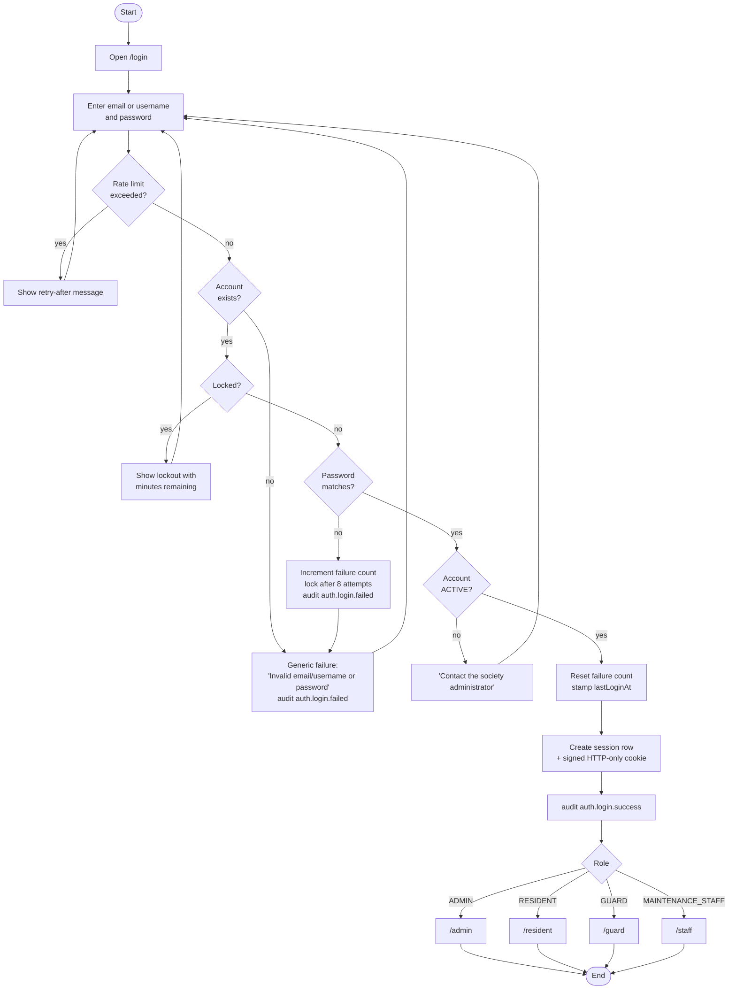
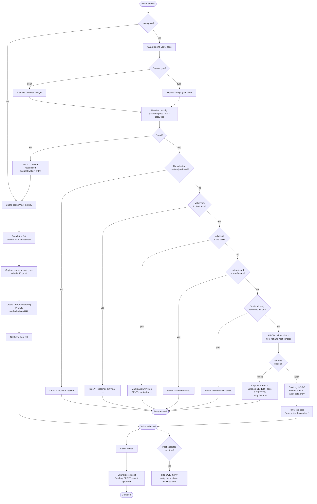
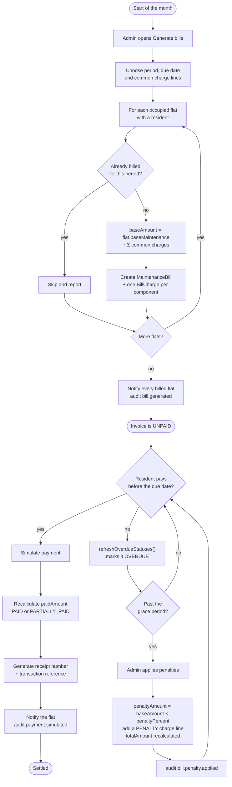
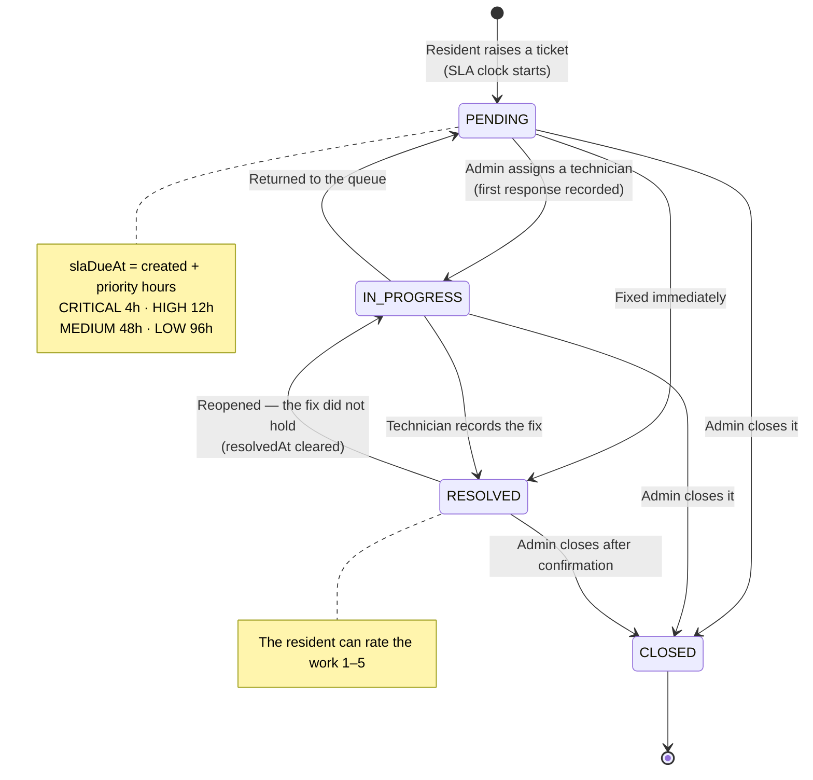
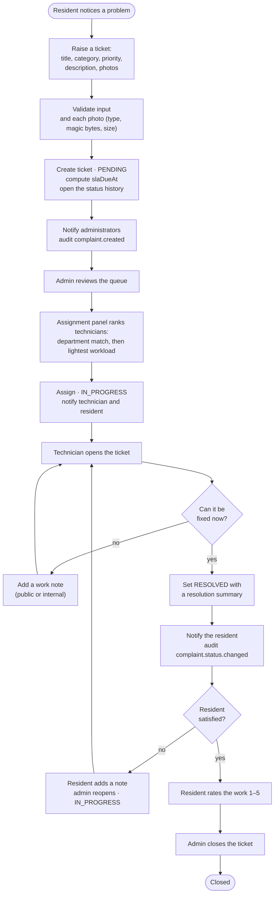
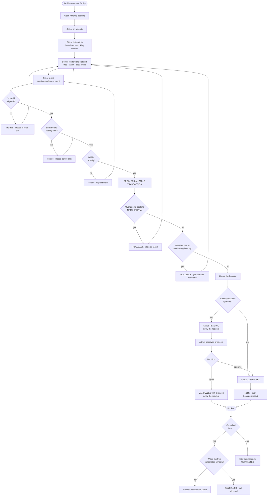
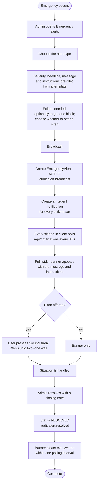
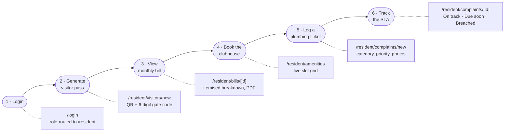
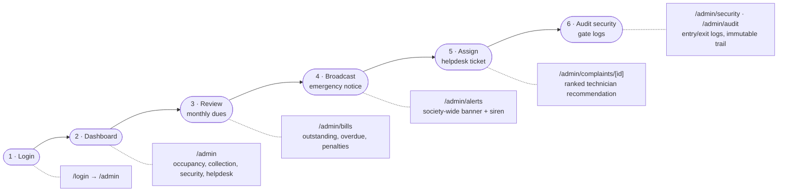

# 8. Workflows — Activity Diagrams & Flowcharts

## 8.1 Authentication and role routing

## 8.2 Visitor verification flow

The society's most latency-sensitive path.

## 8.3 Billing lifecycle

## 8.4 Complaint lifecycle

### Complaint activity flow

## 8.5 Amenity booking flow

## 8.6 Emergency alert flow

## 8.7 Resident journey

The journey named in SRS §1.6, end to end.

Covered end-to-end by `tests/e2e/resident-journey.spec.ts`.

## 8.8 Administrator journey

Covered end-to-end by `tests/e2e/gate-and-admin.spec.ts`.

## 8.9 Resident onboarding and offboarding

```mermaid
flowchart TD
    subgraph Onboarding
        A1["Admin opens Residents → Onboard"] --> A2["Enter details, choose flat and type"]
        A2 --> A3{Password<br/>supplied?}
        A3 -- no --> A4["Generate a temporary password"]
        A3 -- yes --> A5["Use the supplied password"]
        A4 & A5 --> A6["Create the user (bcrypt hash)<br/>+ resident profile"]
        A6 --> A7["Flat → OCCUPIED,<br/>occupancyType set"]
        A7 --> A8{Primary<br/>contact?}
        A8 -- yes --> A9["Demote any existing primary"]
        A8 -- no --> A10["Keep the current primary"]
        A9 & A10 --> A11["Welcome notification<br/>audit resident.created"]
        A11 --> A12["Show the temporary password once"]
    end

    subgraph Offboarding
        B1["Admin opens Offboard"] --> B2["Set move-out date and reason"]
        B2 --> B3["Soft-delete the profile<br/>user → INACTIVE"]
        B3 --> B4["Revoke every session"]
        B4 --> B5["Cancel active gate passes"]
        B5 --> B6{Other residents<br/>in the flat?}
        B6 -- no --> B7["Flat → VACANT"]
        B6 -- yes --> B8["Promote the longest-standing<br/>resident to primary"]
        B7 & B8 --> B9["Warn if invoices are unsettled<br/>audit resident.offboarded"]
    end
```

Billing and gate history are preserved throughout — offboarding never deletes a
financial or security record.
